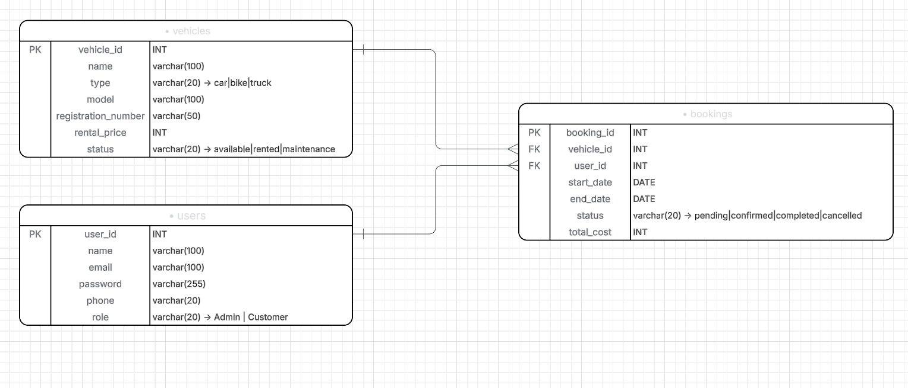

# Vehicle Rental System - Database Design

The **Vehicle Rental System** database designed to manage vehicle rentals, user accounts, and booking transactions.




### Relationships

- **One User → Many Bookings**: A single user can make multiple bookings over time
- **One Vehicle → Many Bookings**: A vehicle can be booked multiple times
- **One Booking → One User**: Each booking belongs to exactly one user
- **One Booking → One Vehicle**: Each booking is for exactly one vehicle

---
### Table I used

```sql
CREATE TYPE  role_type AS ENUM('Admin', 'Customer');

CREATE TABLE IF NOT EXISTS users(
    user_id SERIAL PRIMARY KEY,
    name VARCHAR(100) NOT NULL,
    email VARCHAR(100) UNIQUE NOT NULL,
    password VARCHAR(255) DEFAULT '123456',
    phone VARCHAR(20),
    role role_type NOT NULL DEFAULT 'Customer'
);


CREATE TYPE status_type AS ENUM('available', 'rented', 'maintenance');
CREATE TYPE vehicle_type AS ENUM('car', 'bike', 'truck');

CREATE TABLE IF NOT EXISTS vehicles(
    vehicle_id SERIAL PRIMARY KEY,
    name VARCHAR(100) NOT NULL,
    type vehicle_type NOT NULL,
    model VARCHAR(100),
    registration_number VARCHAR(20) UNIQUE NOT NULL,
    rental_price INT NOT NULL,
    status status_type NOT NULL DEFAULT 'available'
);


CREATE TYPE booking_status_type AS ENUM('pending', 'confirmed', 'completed', 'cancelled');

CREATE TABLE IF NOT EXISTS bookings(
    booking_id SERIAL PRIMARY KEY,
    vehicle_id INT REFERENCES vehicles(vehicle_id),
    user_id INT REFERENCES users(user_id),
    start_date DATE NOT NULL,
    end_date DATE NOT NULL,
    booking_status booking_status_type NOT NULL DEFAULT 'pending',
    total_cost INT NOT NULL
);
```


## SQL Query Solutions Explained

### Query 1: JOIN Operation

**Objective**:
Get booking details along with customer name and vehicle name.

**Explanation**:
We use INNER JOIN to connect three tables: bookings, users and vehicles.
This helps us see data together instead of separate tables.

**Why Important**:
In real application, we need full info.
Only booking table is not useful. We must know who booked and which vehicle.

**Result**:
Shows booking info like user name, vehicle name, booking date and total cost.

---

### Query 2: NOT EXISTS Subquery

**Objective**:
Find vehicles which never booked by anyone.

**Explanation**:
NOT EXISTS check booking table.
If booking not found for a vehicle, then that vehicle is selected.

**Why Important**:
Helps business to find unused vehicles.
These vehicles may need promotion or price change.

**Result**:
List of vehicles which have no booking at all.

---

### Query 3: WHERE Clause

**Objective**:
Get all available cars.

**Explanation**:
WHERE condition is used to filter data.
We check vehicle type is car and status is available.

**Why Important**:
Customer should see only available vehicles.
No one wants to see rented or under maintenance vehicle.

**Result**:
Only cars which are ready for rent.

---

### Query 4: GROUP BY and HAVING

**Objective**: 
Find vehicles which booked more than 2 times.

**Explanation**:
GROUP BY is used to group booking by vehicle.
COUNT calculate how many times vehicle booked.
HAVING filter result after counting.

**Why Important**:
Shows which vehicle is popular.
Business can understand which vehicle earn more money.

**Result**:
Vehicles which booked more than two times.

